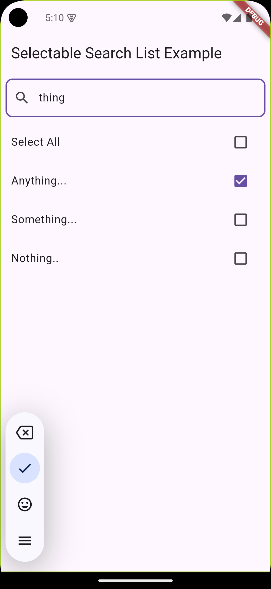

# Selectable Search List

A Flutter package to provide a searchable and selectable list with select/unselect functionality, including the option to select or deselect all items at once.




## Features

- **Searchable List:** Easily search for items within the list.
- **Individual Selection:** Select or unselect items individually.
- **Select/Deselect All:** A convenient option to select or deselect all items in the list.

## Getting Started

To use the **selectable_search_list** package in your Flutter project, follow these steps:

### 1. Add Dependency

Add the following line to your `pubspec.yaml` file:

```yaml
dependencies:
  selectable_search_list: ^0.0.1 # Replace with the latest version
